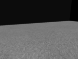

# AWS Deepracer Simulation round solution

Solution was developed in collaboration with [@DAOvb](https://github.com/DAOvb).

[challenge url](https://www.aicrowd.com/challenges/neurips-2021-aws-deepracer-ai-driving-olympics-challenge)

Solution is based on a simple PPO algorithm, achieves near-optimal score in AWS Deepracer environment.

To start training run:
```
docker-compose up -d
python run_ppo_train.py
```

To create a gif of agent's rollout run
```
python create_gif.py save/best_416_iconic-field-98_6env_SCLight_4st1sk.pickle 
```

